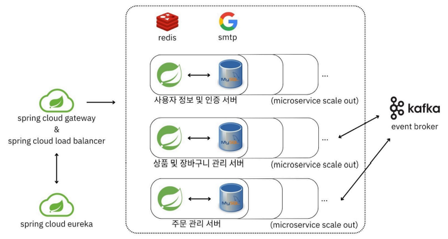

## 🖥️ 프로젝트 소개 

변화하는 트래픽 양에 따라 유연하게 서버를 운영할 수 있도록 MSA를 도입한 전자기기 E-commerce 서비스

## 📌 프로젝트 기능

### 🛡 회원가입 & 이메일 인증 / 로그인

>- 모든 개인정보를 암호화하여 저장합니다.
>- Username 중복 체크와 이메일 인증을 거쳐 회원가입을 할 수 있습니다.
>- Username, Password를 받아 DB에 저장된 값으로 검증하여 로그인할 수 있습니다.
>- 로그인에 성공하면 토큰을 발행받음으로써 권한이 필요한 작업들을 수행할 수 있습니다.

### 👨‍💻 마이페이지

> - 개인정보 확인
> - 비밀번호와 전화번호 수정

### 📦 상품 서비스

> - 모든 상품 리스트, 상품 상세 정보 조회
> - 상품 등록
> - 위시리스트에 담기, 담은 상품 수량 조절, 제거

### 🛻 주문 서비스

> - 주문 상태 조회(결제 대기, 완료, 주문 취소, 반품 등)
> - 주문하기
> - 결제하기
> - 주문 취소 / 환불
> - 배송 생성
> - 배송지목록 관리

## 🗂 ERD

## 🚧 시스템 아키텍처

## 🤔 기술적 의사결정

### 인가 처리 방식 [Wiki >](https://github.com/jewoodev/lay-by/wiki/%5B%EA%B8%B0%EC%88%A0%EC%A0%81-%EC%9D%98%EC%82%AC%EA%B2%B0%EC%A0%95%5D-%EC%9D%B8%EC%A6%9D,-%EC%9D%B8%EA%B0%80-%EC%B2%98%EB%A6%AC-%EB%B0%A9%EC%8B%9D)

> 어플리케이션의 구조와 효율적인 비용 전략이 고려된 인가 처리 방식이 사용됩니다.

### API Gateway [Wiki >](https://github.com/jewoodev/lay-by/wiki/%5B%EA%B8%B0%EC%88%A0%EC%A0%81-%EC%9D%98%EC%82%AC%EA%B2%B0%EC%A0%95%5D-API-Gateway)

> 트래픽에 따라 스케일링 되는 서비스들을 라우팅하고 권한이 필요한 요청에 인가처리를 합니다. 

### Scheduler [Wiki >](https://github.com/jewoodev/lay-by/wiki/%5B%EA%B8%B0%EC%88%A0%EC%A0%81-%EC%9D%98%EC%82%AC%EA%B2%B0%EC%A0%95%5D-Scheduler)

> 배치 작업을 스케줄링하여 주문 상태, 배송 상태를 시간에 따라 변경합니다.

### Redis [Wiki >](https://github.com/jewoodev/lay-by/wiki/%5B%EA%B8%B0%EC%88%A0%EC%A0%81-%EC%9D%98%EC%82%AC%EA%B2%B0%EC%A0%95%5D-Redis)

> 연속된 요청으로 인한 DB 병목현상을 완화하고 보관 기간 설정이 필요한 정보들을 관리합니다. 

### Kafka [Wiki >](https://github.com/jewoodev/lay-by/wiki/%5B%EA%B8%B0%EC%88%A0%EC%A0%81-%EC%9D%98%EC%82%AC%EA%B2%B0%EC%A0%95%5D-Kafka)

> 분산 환경에서 다수의 서비스 로직이 사용되어야 하는 API를 관리하기 위해 MQ를 사용합니다.

### k6 [Wiki >](https://github.com/jewoodev/lay-by/wiki/%5B%EA%B8%B0%EC%88%A0%EC%A0%81-%EC%9D%98%EC%82%AC%EA%B2%B0%EC%A0%95%5D-k6)

> 요구되는 테스트 복잡도를 구현할 수 있으면서 가장 적은 리소스를 사용하는 테스트 도구를 사용합니다.

## 🚨 트러블슈팅

### authenticate() 메서드에서 401 상태만을 반환하는 문제 [Wiki >](https://github.com/jewoodev/lay-by/wiki/%5BTroubleshooting%5D-JWT-%EB%A1%9C%EC%A7%81-%EB%AC%B8%EC%A0%9C)

### 연관관계 매핑에서 비롯된 MSA 전환 문제 [Wiki >](https://github.com/jewoodev/lay-by/wiki/%5BTroubleshooting%5D-%EC%97%B0%EA%B4%80%EA%B4%80%EA%B3%84-%EB%A7%A4%ED%95%91%EC%97%90%EC%84%9C-%EB%B9%84%EB%A1%AF%EB%90%9C-MSA-%EC%A0%84%ED%99%98-%EB%AC%B8%EC%A0%9C)

### 재고 처리에서 생겨나는 동시성 문제 [Wiki >](https://github.com/jewoodev/lay-by/wiki/%5BTroubleshooting%5D-%EB%8F%99%EC%8B%9C%EC%84%B1-%EB%AC%B8%EC%A0%9C-%ED%95%B4%EA%B2%B0)

## ⏩ 성능 개선

### 다수의 서비스가 통신할 필요가 있는 로직의 성능 개선 [Wiki >](https://github.com/jewoodev/lay-by/wiki/%5B%EC%84%B1%EB%8A%A5-%EA%B0%9C%EC%84%A0%5D-%EB%8B%A4%EC%88%98%EC%9D%98-%EC%84%9C%EB%B9%84%EC%8A%A4%EA%B0%80-%ED%86%B5%EC%8B%A0%ED%95%A0-%ED%95%84%EC%9A%94%EA%B0%80-%EC%9E%88%EB%8A%94-%EB%A1%9C%EC%A7%81%EC%9D%98-%EC%84%B1%EB%8A%A5-%EA%B0%9C%EC%84%A0)

## 📚 API 명세서

### 명세서 문서 확인하기 [Click](https://abiding-maple-302.notion.site/API-8f47025d489f4672bbed25ab7021f49f?pvs=4)

## ⚙️ 개발 환경

- Java 21
- Spring Boot 3.2.4 (Spring Data JPA(3.2.4), QueryDSL(querydsl-jpa:5.0.0:jakarta), MVC(spring-webmvc:6.1.5))
- Spring Cloud Eureka(4.1.1), Gateway(4.1.2), Load Balancer(4.1.2), Resilience4j(3.1.1), Validation(3.0.2), Mail Sender(spring-boot-starter-mail:3.2.4)
- Kafka(spring-kafka:3.1.3, kafka-clients:3.6.1), JWT(jjwt:0.11.5)
- Redis(spring-data-redis:3.2.4), Redisson(3.23.2)

   

       

  

## 🕰️ 개발 기간 및 인원 

- 개발 기간 : 4/17 ~ 5/9
- 개발 인원 : 1명
